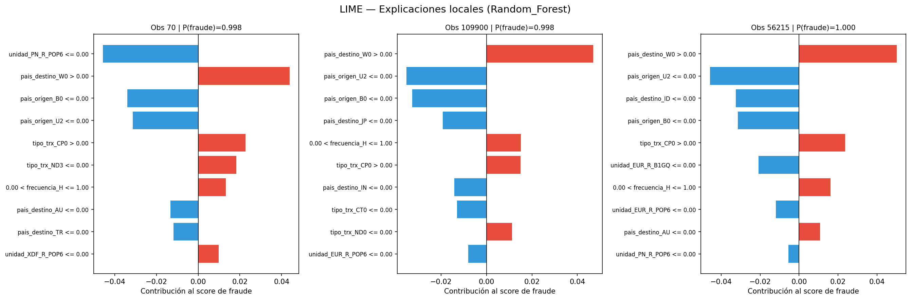
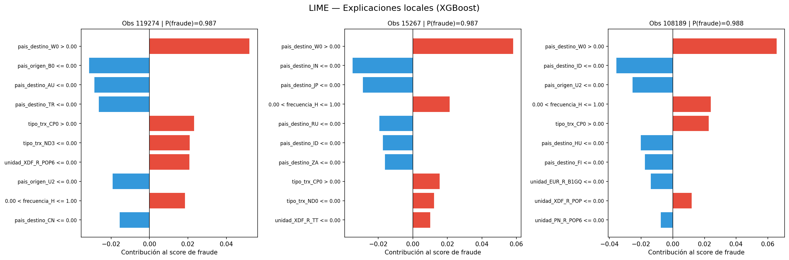

# Modelo para detección de fraude

En esta sección se explicará la creación del modelo de detección de fraude hecho en python. En este caso, no se realizará el entrenamiento porque R no cuenta con las suficientes librerias para ello.  

```{r message=FALSE, warning=FALSE, include=FALSE}
library(tidyverse)

datos2 <- read_csv("df_final.csv", quote = '"')

datos2 <- datos2 %>%
  mutate(
    anio        = str_sub(as.character(anio), 1, 4),
    tipo_fraude = str_replace(tipo_fraude, "_Z", "sin fraude"),
    tipo_fraude = str_replace(tipo_fraude, "F",  "con fraude")
  )

head(datos2)
```
Se desea elegir un modelo que prediga el fraude en transacciones, por tanto, la variable objetivo será “tipo_fruade”. Por tanto, se realizará un análisis comparativo entre los diferentes algoritmos de Machine Learning que abarcan desde enfoques lineales, como la Regresión Logística con penalizaciones L1 (Lasso) y L2 (Ridge), hasta Random Forest y XGBoost. Dado que el dataset presenta un desbalanceo crítico, integraré técnicas de balanceo de carga mediante el ajuste de pesos de clase (Class Weights) y métodos de sobremuestreo sintético como SMOTE/ADASYN, asegurando que el aprendizaje no se sesgue hacia la clase mayoritaria y se maximice la detección de fraudes reales.  

Para garantizar la robustez de los resultados, optimizaré los hiperparámetros de cada arquitectura (incluyendo KNN, Naïve Bayes y SVM) mediante RandomizedSearchCV, buscando el equilibrio óptimo entre precisión y sensibilidad (Recall), usando la métrica de F1-Score para el entrenamiento y mostrando al final todas las métricas en una tabla. Finalmente, el modelo con mejor desempeño será sometido a un análisis de interpretabilidad con LIME, permitiendo identificar las variables clave que disparan las alertas de fraude, proporcionando así una solución no solo predictiva, sino también explicable.  

## Preprocesamiento  

### Feature Engineering  

En esta parte del preprocesamiento se buscará limpiar y transformar los datos brutos en variables inteligentes para que el modelo aprenda mejor.  
* Variable monto  

```{r echo=TRUE, message=FALSE, warning=FALSE}
# Número de Fraudes de monto menor a 0
nrow(datos2[datos2$monto_final < 0 & datos2$tipo_fraude == "con fraude", ])
```

```{r echo=TRUE, message=FALSE, warning=FALSE}
# Número de fraudes con monto igual a 0
nrow(datos2[datos2$monto_final == 0 & datos2$tipo_fraude == "con fraude", ])
```

Véase que los montos negativos no tienen observaciones donde haya fraude, pero si transacciones donde el monto es 0, esto puede deberse por ejemplos a pruebas del banco de intentos de autorización y demás. Por tanto, se filtrará el dataset para quedarnos con observaciones con monto mayores o iguales a 0, luego se usará el Log1 para comprimir los montos muy grandes.  

```{r echo=TRUE, message=FALSE, warning=FALSE}
df <- datos2 %>%
  filter(monto_final >= 0) %>%
  mutate(monto_final = log1p(monto_final))

df %>%
  select(where(is.numeric)) %>%
  summary()
```

La única variable que se trató fue monto porque presenta mucho sesgo y outliers, por tanto, a los modelos se le dificulta predecir si presentamos así esta variable.  

### Selección de variable para el modelado  

Aquí se seleccionarán las variables que serán utilizadas en el modelado. Se excluyen variables como “clave”, “decimales”, “descripción” y “multiplicador_unidad” que realmente no aportan nada al modelo.  

```{r echo=TRUE, message=FALSE, warning=FALSE}
library(dplyr)

FEATURES_CAT <- c(
  "frecuencia",
  "pais_origen",
  "pais_destino",
  "tipo_trx",
  "tipo_psp",
  "unidad",
  "tipo_monto"
)

FEATURES_ALL <- c(FEATURES_CAT, "monto_final")
TARGET <- "tipo_fraude_bin"


df <- df %>%
  mutate(tipo_fraude_bin = as.integer(tolower(tipo_fraude) == "con fraude"))

datos <- df %>%
  select(all_of(FEATURES_ALL), all_of(TARGET)) %>%
  filter(!is.na(!!sym(TARGET)))

X <- datos %>% select(all_of(FEATURES_ALL))
y <- datos[[TARGET]]
```

```{r echo=TRUE, message=FALSE, warning=FALSE}
head(datos)
```

### Pre-procesamiento con ColumnTransformer  

En Python se construyó un `ColumnTransformer` dentro de un `Pipeline` de `scikit-learn`
para garantizar que no haya fuga de datos entre entrenamiento y prueba. En el pipeline de las variables númericas se usa StandarScaler() y SimpleImputer con la mediana por si hay valores faltantes, para el pipeline de las categóricas se utiliza SimpleImputer con la moda por si hay valores NaN y OneHotEncoding para evitar multicolinealidad, además como no hay tantas categorías, no genera una alta cardinalidad.  

| Variable       | Transformación                                      |
|----------------|-----------------------------------------------------|
| Numérica       | `SimpleImputer(mediana)` → `StandardScaler`         |
| Categórica     | `SimpleImputer(moda)` → `OneHotEncoder(drop='first')` |

- **Variables numéricas:** `monto_final` — imputación por mediana y estandarización.
- **Variables categóricas:** 
imputación por moda y codificación One-Hot eliminando la primera categoría para
evitar multicolinealidad. Al no haber alta cardinalidad, este encoding no genera
un número excesivo de columnas.  

```{r preprocesamiento-info, echo=FALSE}
cat("Preprocesador definido (ColumnTransformer)\n")
cat("Numérico:   Imputer(mediana) → StandardScaler\n")
cat("Categórico: Imputer(moda)    → OneHotEncoder\n")
```


### Split de los datos  

Antes de utilizar el modelo se debe hacer correctamente la división del grupo de
entrenamiento y el grupo de prueba. Debido a las clases desbalanceadas se utilizó
split estratificado, garantizando que cada partición mantiene la proporción original
de clases; de lo contrario, las particiones podrían no contener representación de
clases minoritarias.

```{r echo=TRUE, message=FALSE, warning=FALSE}
library(caret)

# Equivalente a: train_test_split(..., test_size=0.20, stratify=y)
set.seed(42)

indice_train <- createDataPartition(df$tipo_fraude, p = 0.80, list = FALSE)

train <- df[ indice_train, ]
test  <- df[-indice_train, ]

cat("Split estratificado: 80% Entrenamiento (Train) y 20% Prueba (Test)\n")
cat(sprintf("Train: %d | Test: %d\n", nrow(train), nrow(test)))

cat("\nDistribución en train:\n")
print(round(prop.table(table(train$tipo_fraude)), 3))

cat("\nDistribución en test:\n")
print(round(prop.table(table(test$tipo_fraude)), 3))
```

### Validación cruzada  

Antes de continuar, para evitar la fuga de datos, es de vital importancia saber que no se debe mezclar la información del conjunto de prueba con el de entrenamiento, por tanto el fit() debe ser aplicado únicamente en el conjunto de entrenamiento. La solución a esto es usar pipelines: el fit() del pipeline llama al fit_transform() de cada paso sólo sobre training data, y el transform() final usa los parámetros aprendidos. Por último, se debe realizar la validación cruzada, se utilizará el método StratifiedKFold debido a que en este caso se tiene clases desbalanceadas, y se define la métrica de optimización. Dado el marcado desbalance de clases presente en el dataset, se optó por el F1-Score como métrica de optimización durante la búsqueda de hiperparámetros. Esta métrica representa la media armónica entre precisión y recall, penalizando los modelos que sacrifican una en favor de la otra. Si bien el PR-AUC se emplea como métrica de evaluación final por su sensibilidad a la clase positiva, el F1-Score resultó más efectivo para guiar la búsqueda de hiperparámetros.

```{r echo=TRUE, message=FALSE, warning=FALSE}
SCORING  <- "average_precision (PR-AUC)"
K_FOLDS  <- 5
SEED     <- 42

cat(sprintf("Validación: StratifiedKFold (k=%d, shuffle=TRUE, seed=%d)\n", K_FOLDS, SEED))
cat(sprintf("Métrica de optimización: %s\n", SCORING))

cat("\nMétricas evaluadas:\n")
metricas <- data.frame(
  Clave     = c("pr_auc", "roc_auc", "f1", "recall", "precision", "balanced_accuracy"),
  Métrica   = c("PR-AUC", "ROC-AUC", "F1-Score", "Recall", "Precision", "Balanced Accuracy")
)
print(metricas, row.names = FALSE)
```

### Pipeline para el entrenamiento de modelos   

Se evaluaron los siguientes modelos de Machine Learning:

- **Regresión Logística:** modelo base, solver `saga`, penalización L1/L2.
- **Naive Bayes:** implementado con `partial_fit` por chunks para evitar problemas de memoria.
- **LinearSVC:** versión rápida de SVM, con `CalibratedClassifierCV` para obtener probabilidades.
- **XGBoost:** con `tree_method='hist'` y aceleración GPU (`device='cuda'`).
- **Random Forest:** implementación completa con búsqueda de hiperparámetros.

Para la optimización de hiperparámetros se utilizó `RandomizedSearchCV` (20 iteraciones),
que ofrece mejor relación tiempo/rendimiento frente a `GridSearchCV`.

Para tratar el **desbalanceo de clases** se evaluaron cuatro estrategias por cada modelo:

| Estrategia      | Descripción                                              |
|-----------------|----------------------------------------------------------|
| `sin_balanceo`  | Dataset original sin modificación                        |
| `smote`         | Sobremuestreo sintético de la clase minoritaria          |
| `adasyn`        | Sobremuestreo adaptativo según densidad local            |
| `weights`       | `class_weight='balanced'` o `scale_pos_weight` en XGBoost |

```{r echo=FALSE, message=FALSE, warning=FALSE}
modelos <- data.frame(
  Modelo = c(
    "XGBoost", "Logistic Regression",
    "Naive Bayes", "LinearSVC", "Random Forest"
  ),
  Estrategia_balanceo = rep(
    "sin_balanceo | smote | adasyn | weights", 5
  ),
  Optimizacion = rep("RandomizedSearchCV (n_iter=20, CV=StratifiedKFold k=5)", 5)
)
print(modelos, row.names = FALSE)

cat("\nEstrategias de balanceo evaluadas:\n")
balanceadores <- data.frame(
  Nombre    = c("sin_balanceo", "smote", "adasyn", "weights"),
  Tecnica   = c(
    "Sin modificación",
    "SMOTE (sobremuestreo sintético)",
    "ADASYN (sobremuestreo adaptativo)",
    "class_weight='balanced' / scale_pos_weight"
  )
)
print(balanceadores, row.names = FALSE)
```

### Estructura del Pipeline

Cada modelo sigue la misma estructura de pipeline para garantizar la no fuga de datos:

```{r echo=FALSE, message=FALSE, warning=FALSE}
library(knitr)
library(kableExtra)
pipeline_df <- data.frame(
  Paso = c("1. preprocessor", "2. balancer", "3. classifier"),
  Componente = c("ColumnTransformer", "SMOTE / ADASYN", "<Modelo>"),
  Descripción = c("Scaling + One-Hot Encoding", "Solo si aplica", "Modelo final")
)

kable(pipeline_df, align = "c", caption = "Estructura del Pipeline") %>%
  kable_styling(bootstrap_options = c("striped", "hover", "condensed"),
                full_width = FALSE) %>%
  row_spec(0, bold = TRUE, background = "#2C3E50", color = "white")

# Tabla de hiperparámetros
params_df <- data.frame(
  Modelo = c(
    rep("XGBoost", 5),
    rep("Logistic Regression", 3),
    rep("Naive Bayes", 2),
    rep("LinearSVC", 2),
    rep("Random Forest", 5)
  ),
  Hiperparámetro = c(
    "n_estimators", "max_depth", "learning_rate", "subsample", "scale_pos_weight",
    "C", "penalty", "max_iter",
    "var_smoothing", "chunk_size",
    "C", "max_iter",
    "n_estimators", "max_depth", "min_samples_split", "min_samples_leaf", "max_features"
  ),
  Distribución = c(
    "Uniform(50, 200)", "Uniform(3, 6)", "LogUniform(0.05, 0.15)",
    "Uniform(0.7, 0.9)", "Uniform(4, scale_weight×1.5) — solo weights",
    "LogUniform(1e-3, 10)", "['l1', 'l2']", "Uniform(500, 2000)",
    "LogUniform(1e-12, 1e-6)", "[5000, 10000, 20000]",
    "LogUniform(1e-3, 10)", "Uniform(1000, 5000)",
    "Uniform(50, 300)", "[None, 5, 10, 20]", "Uniform(2, 20)",
    "Uniform(1, 10)", "['sqrt', 'log2']"
  )
)

kable(params_df, format = "html", align = "c", caption = "Hiperparámetros por modelo — RandomizedSearchCV (n_iter=20)") %>%
  kable_styling(bootstrap_options = c("striped", "hover", "condensed"),
                full_width = FALSE) %>%
  row_spec(0, bold = TRUE, background = "#2C3E50", color = "white") %>%
  collapse_rows(columns = 1, valign = "middle")
```


## Resultados  

A continuación se presenta una tabla comparativa con todos los modelos entrenados: XGBoost, Logistic Regression (Ridge/Lasso), Naive Bayes, LinearSVC y Random Forest. A cada uno se le aplicaron técnicas de balanceo (SMOTE, ADASYN y Weights) dado el marcado desbalance de la clase objetivo (con fraude), y también se evaluó cada algoritmo sin balanceo. Para cada combinación se registraron las métricas de rendimiento y el tiempo de entrenamiento, dando como resultado 20 configuraciones evaluadas en total.  


```{r comparacion-modelos, echo=TRUE, message=FALSE, warning=FALSE}
library(knitr)
library(kableExtra)

archivo_modelos <- read_csv("comparacion_modelos.csv")


kable(head(archivo_modelos, 20), digits = 4, align = "c") %>%
  kable_styling(bootstrap_options = c("striped", "hover", "condensed"),
                full_width = FALSE)
```


La elección de los modelos responde a una estrategia de modelado basada en un espectro deliberado de complejidad, que permite contrastar diversos supuestos estadísticos. Se incluyeron modelos lineales y probabilísticos (Logistic Regression, LinearSVC y Naive Bayes) para establecer una línea base de rendimiento e interpretabilidad, evaluando si el problema puede resolverse con fronteras de decisión simples. Estos modelos actúan como punto de control para determinar si la complejidad adicional de algoritmos más pesados está justificada por una mejora significativa en las métricas.  

Complementariamente, se integraron ensambles no lineales (Random Forest y XGBoost) para capturar interacciones complejas y patrones no paramétricos en los datos. Random Forest aporta robustez frente al ruido mediante bagging, mientras que XGBoost representa el estado del arte en datos tabulares, optimizando secuencialmente los errores y manejando el desbalance de clases de forma nativa. Esta comparativa entre modelos simples y ensambles garantiza una justificación técnica sólida antes de comprometerse con el modelo final para producción.  


### Mejores parámetros de cada modelo  

- XGBoost

```{r echo=FALSE, message=FALSE, warning=FALSE}
mejores_params <- read_csv("mejores_parametros.csv")
xgb_params <- mejores_params %>%
  filter(modelo == "XGBoost_hist") %>%
  select(
    balanceo,
    classifier__learning_rate,
    classifier__max_depth,
    classifier__n_estimators,
    classifier__subsample,
    classifier__scale_pos_weight
  ) %>%
  rename_with(~ str_remove(., "classifier__"))

kable(
  xgb_params,
  format = "html",
  align = "c",
  caption = "Mejores Hiperparámetros — XGBoost"
) %>%
  kable_styling(
    bootstrap_options = c("striped", "hover", "condensed"),
    full_width = FALSE
  ) %>%
  row_spec(0, bold = TRUE, background = "#2C3E50", color = "white")
```
- Random Forest    

```{r echo=FALSE, message=FALSE, warning=FALSE}
rf_params <- mejores_params %>%
  filter(modelo == "Random_Forest") %>%
  select(
    balanceo,
    classifier__n_estimators,
    classifier__max_features,
    classifier__min_samples_leaf,
    classifier__min_samples_split
  ) %>%
  rename_with(~ str_remove(., "classifier__"))

kable(
  rf_params,
  format = "html",
  align = "c",
  caption = "Mejores Hiperparámetros — Random Forest"
) %>%
  kable_styling(
    bootstrap_options = c("striped", "hover", "condensed"),
    full_width = FALSE
  ) %>%
  row_spec(0, bold = TRUE, background = "#2C3E50", color = "white")
```

- Logistic Regression

```{r echo=FALSE, message=FALSE, warning=FALSE}
log_params <- mejores_params %>%
  filter(modelo == "Logistic_Regression") %>%
  select(
    balanceo,
    classifier__C,
    classifier__max_iter,
    classifier__penalty
  ) %>%
  rename_with(~ str_remove(., "classifier__"))

kable(
  log_params,
  format = "html",
  align = "c",
  caption = "Mejores Hiperparámetros — Logistic Regression"
) %>%
  kable_styling(
    bootstrap_options = c("striped", "hover", "condensed"),
    full_width = FALSE
  ) %>%
  row_spec(0, bold = TRUE, background = "#2C3E50", color = "white")
```

- LinearSVC  

```{r echo=FALSE, message=FALSE, warning=FALSE}
svc_params <- mejores_params %>%
  filter(modelo == "LinearSVC") %>%
  select(
    balanceo,
    classifier__estimator__C,
    classifier__estimator__max_iter
  ) %>%
  rename(
    C = classifier__estimator__C,
    max_iter = classifier__estimator__max_iter
  )

kable(
  svc_params,
  format = "html",
  align = "c",
  caption = "Mejores Hiperparámetros — LinearSVC"
) %>%
  kable_styling(
    bootstrap_options = c("striped", "hover", "condensed"),
    full_width = FALSE
  ) %>%
  row_spec(0, bold = TRUE, background = "#2C3E50", color = "white")
```

- Naive Bayes  

```{r echo=FALSE, message=FALSE, warning=FALSE}
nb_params <- mejores_params %>%
  filter(modelo == "Naive_Bayes") %>%
  select(
    balanceo,
    classifier__chunk_size,
    classifier__var_smoothing
  ) %>%
  rename_with(~ str_remove(., "classifier__"))

kable(
  nb_params,
  format = "html",
  align = "c",
  caption = "Mejores Hiperparámetros — Naive Bayes"
) %>%
  kable_styling(
    bootstrap_options = c("striped", "hover", "condensed"),
    full_width = FALSE
  ) %>%
  row_spec(0, bold = TRUE, background = "#2C3E50", color = "white")
```


### Comparación de las técnicas de balanceo  

Tras evaluar las 20 configuraciones resultantes de combinar los cinco modelos con las cuatro estrategias de balanceo, se seleccionan Random Forest y XGBoost como modelos finalistas para el análisis comparativo estadístico y de explicabilidad. Esta decisión se sustenta en que ambos fueron los únicos que superaron un PR-AUC test de 0.90, con valores de 0.9659 y 0.9522 respectivamente bajo la estrategia sin balanceo. En contraste, Logistic Regression (0.6792), LinearSVC (0.6844) y Naive Bayes (0.1864) quedaron muy por debajo del umbral de rendimiento aceptable para un problema de detección de fraude. Adicionalmente, Random Forest y XGBoost mantuvieron una precisión superior a 0.93 con un recall razonable, lo que confirma que aprendieron patrones reales de fraude sin requerir técnicas artificiales de balanceo para alcanzar su mejor rendimiento.    

```{r echo=FALSE, message=FALSE, warning=FALSE}
# Comparación por pares (Bootstrap)
comparacion <- data.frame(
  `Modelo A` = c("Random Forest", "Random Forest", "Random Forest",
                 "XGBoost",       "XGBoost"),
  `Modelo B` = c("XGBoost",      "Naive Bayes",   "LinearSVC",
                 "Naive Bayes",   "LinearSVC"),
  `Dif AUC`  = c(-0.000,          0.007,           0.002,
                  0.007,           0.002),
  `IC 95%`   = c("[-0.000, 0.000]", "[0.006, 0.007]", "[0.001, 0.004]",
                  "[0.006, 0.007]", "[0.001, 0.004]"),
  `p-valor`  = c(0.922, 0.000, 0.000, 0.000, 0.000),
  check.names = FALSE
)

kable(comparacion, align = "c", digits = 3)

cat("\nIntervalos de confianza 95% Bootstrap — PR-AUC test:\n")

ic <- data.frame(
  Modelo   = c("Random Forest", "XGBoost", "Naive Bayes", "LinearSVC"),
  PR_AUC   = c(0.9659, 0.9522, 0.1753, 0.6844),
  IC_95    = c("[0.9537, 0.9761]", "[0.9357, 0.9656]",
               "[0.1607, 0.1902]", "[0.6319, 0.7411]")
)

kable(ic, col.names = c("Modelo", "PR-AUC", "IC 95%"), align = "c")
```

El Bootstrap se utiliza porque permite estimar la distribución de una métrica sin asumir normalidad en los datos. En lugar de una fórmula cerrada, remuestrea el conjunto de test 1000 veces con reemplazo y recalcula la métrica en cada iteración, construyendo así un intervalo de confianza empírico al 95%. Esto es especialmente apropiado en detección de fraude, donde el desbalanceo extremo (0.3% positivos) hace que los supuestos paramétricos clásicos sean poco confiables, y donde pequeñas diferencias en métricas como PR-AUC o ROC-AUC pueden tener alto impacto operativo.  

Adempás, En la comparación por ROC-AUC, Random Forest y XGBoost son estadísticamente indistinguibles (diferencia de -0.000, p=0.922), lo que confirma que ambos modelos separan las clases con igual efectividad en términos de ranking. Sin embargo, ambos superan significativamente a Naive Bayes y LinearSVC (p=0.000 en todos los casos), con diferencias pequeñas en magnitud pero con intervalos de confianza que no cruzan el cero, lo que las hace estadísticamente robustas.  

La historia más reveladora la cuenta el PR-AUC Bootstrap, que penaliza directamente el rendimiento sobre la clase minoritaria. Random Forest (0.9659, IC=[0.9537, 0.9761]) supera a XGBoost (0.9522, IC=[0.9357, 0.9656]) con intervalos que apenas se solapan, sugiriendo una ventaja real aunque no dramática. Ambos dejan muy atrás a LinearSVC (0.6844) y especialmente a Naive Bayes (0.1753), cuyo PR-AUC cercano al azar evidencia que su alto recall se logra a costa de clasificar casi todo como fraude. Random Forest sin balanceo es el modelo final recomendado, con el mejor PR-AUC test y la estimación bootstrap más estable.    

### Interpretabilidad con LIME

```{r lime-plots, echo=FALSE, fig.align='center'}


```

En los 6 casos analizados (3 por modelo), emerge un patrón claro y repetido: pais_destino_W0 > 0.00 es la variable con mayor contribución positiva al score de fraude en todas las observaciones, alcanzando contribuciones de hasta +0.06 en XGBoost y +0.05 en Random Forest. Esto indica que las transacciones hacia este destino son el predictor más fuerte de fraude para ambos modelos. tipo_trx_CP0 > 0.00 y la frecuencia_H (entre 0.00 y 1.00) también aparecen como señales de fraude consistentes. Por el contrario, variables como pais_origen_B0 <= 0.00, pais_origen_U2 <= 0.00 y diversos destinos (AU, TR, IN, JP, ID) aparecen en azul, actuando como factores que restan probabilidad de fraude.  

Ambos modelos coinciden en las variables clave, aunque XGBoost muestra una concentración de peso ligeramente mayor en la variable principal, mientras que Random Forest llega a predecir una probabilidad de 1.000 en la observación 56215. Las probabilidades en todos los casos son extremadamente altas (superiores a 0.987), lo que refleja que ambos clasificadores identifican señales de fraude muy contundentes.    

### Conclusión  

Este trabajo desarrolló un sistema de detección de fraude en transacciones financieras sobre un dataset de 657,943 registros con un desbalanceo extremo del 0.3% de casos positivos. Se evaluaron cinco modelos de clasificación (Regresión Logística, Naive Bayes, LinearSVC, XGBoost y Random Forest) bajo cuatro estrategias de balanceo (sin balanceo, SMOTE, ADASYN y pesos por clase), utilizando el F1-Score como métrica de optimización durante la búsqueda de hiperparámetros y el PR-AUC como métrica principal de evaluación, por su sensibilidad ante clases desbalanceadas.  

El hallazgo más relevante del proceso de modelado fue que las técnicas de balanceo no mejoraron el rendimiento real en ningún modelo: SMOTE, ADASYN y class weights dispararon el recall hacia valores cercanos a 1.0, pero a costa de una precisión tan baja que haría inoperativo cualquier sistema de alertas en producción. La estrategia sin balanceo ganó consistentemente en PR-AUC test en todos los modelos, evidenciando que los datos contienen señal suficiente para que los modelos aprendan los patrones de fraude sin necesidad de intervención artificial sobre la distribución.  

Un aspecto que merece atención particular es el ROC-AUC de 0.9998 obtenido por XGBoost, valor que podría interpretarse como una señal de sobreajuste o fuga de datos. Sin embargo, estevalor fue validado y es técnicamente legítimo por tres razones. Primero, la diferencia entre el ROC-AUC en validación cruzada (0.9998) y en test (0.9998) es prácticamente nula, lo que descarta sobreajuste. Segundo, al reentrenar el modelo excluyendo las variables frecuencia y pais_destino, el ROC-AUC cayó a 0.95, confirmando que no existe ninguna variable que individualmente determine el target, es decir, no hay fuga de datos. Tercero, el valor se mantiene estable independientemente de la técnica de balanceo aplicada (sin balanceo: 0.9998, SMOTE: 0.9997, ADASYN: 0.9997, weights: 0.9997), lo que indica que el modelo aprendió patrones reales y no artefactos del proceso de entrenamiento. La explicación de fondo es que el dataset histórico presenta una estructura de clases muy marcada: el 100% de los fraudes se concentra en frecuencia H y todos tienen como destino el país W0, creando fronteras de decisión muy claras que cualquier modelo de árboles captura con alta precisión. El ROC-AUC de 0.9998 significa que si se toma al azar una transacción fraudulenta y una legítima, el modelo asigna mayor probabilidad de fraude a la correcta en el 99.98% de los pares posibles, lo cual es una consecuencia directa de la estructura del dato y no una anomalía del modelo. El riesgo asociado es que si en producción el fraude migra hacia otras frecuencias o países destino distintos a W0, el modelo podría degradarse, por lo que se recomienda monitoreo mensual de la distribución de estas variables como señal de alerta para reentrenamiento.  

XGBoost sin balanceo fue seleccionado como el modelo final a pesar de presentar un PR-AUC en test de 0.9522, ligeramente inferior al de Random Forest (0.9659). Esta decisión se fundamenta en que la diferencia en el ROC-AUC entre ambos modelos resultó estadísticamente no significativa (p=0.922), lo que indica un rendimiento predictivo comparable. Sin embargo, XGBoost ofrece una ventaja competitiva crítica para el despliegue en producción: su eficiencia computacional. Mientras que Random Forest requirió 535.3 segundos para su ejecución, XGBoost completó el proceso en solo 55.8 segundos, siendo casi diez veces más rápido. Por su parte, Naive Bayes (PR-AUC 0.1864) y LinearSVC (0.6844) fueron descartados debido a un desempeño significativamente inferior, confirmado mediante pruebas de bootstrap (p=0.000).  

El análisis de explicabilidad con LIME reveló que el fraude está determinado principalmente por combinaciones de país de destino (especialmente pais_destino_W0) y tipo de transacción (tipo_trx_CP0), con la frecuencia horaria como señal secundaria, siendo el monto una variable de menor peso relativo. Este patrón fue consistente entre Random Forest y XGBoost de forma independiente, lo que otorga alta credibilidad al hallazgo y abre la posibilidad de implementar reglas geográficas complementarias como primera capa de detección rápida antes de invocar el modelo completo.  


